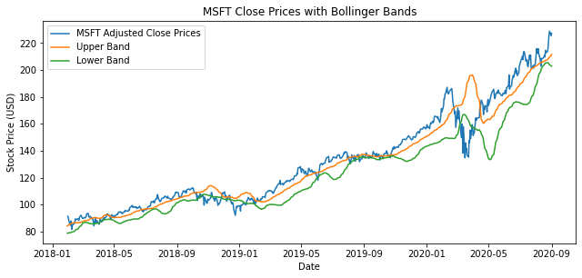

# Algorithmic-Trading-Strategy

### Bollinger Bands

Bollinger Bands trading strategy is a way to use statistical data to create an upper and lower bound based on the moving average of a stock in order to guide investment decisions.  
Typically, the Upper bound takes the standard deviation of the rolling simple moving average of a stock, multiplies it by 2, and then adds that value to the rolling simple moving average.  This results in the upper bound consistently being 2 Standard Deviations above the mean.
The Lower bound would be the same as the Upper bound except it would subtract the 2 Standard Deviations by the mean.
The theory behind why this works is based on the concept, "Regression toward the Mean", where a point (in this case) past 2 Standard Deviations of the mean will likely regress back towards the mean in the future.

### The Trading Strategy

For my trading strategy, I set up these bounds to decide when the stock would be bought and sold.  When the stock would dip below the Lower bound, I would allocate 100% of the money I was using into buying the stock.  Once the stock was bought, I would hold onto the stock until the stock rises above the Upper bound, in which case I would then sell 100% of that stock.

